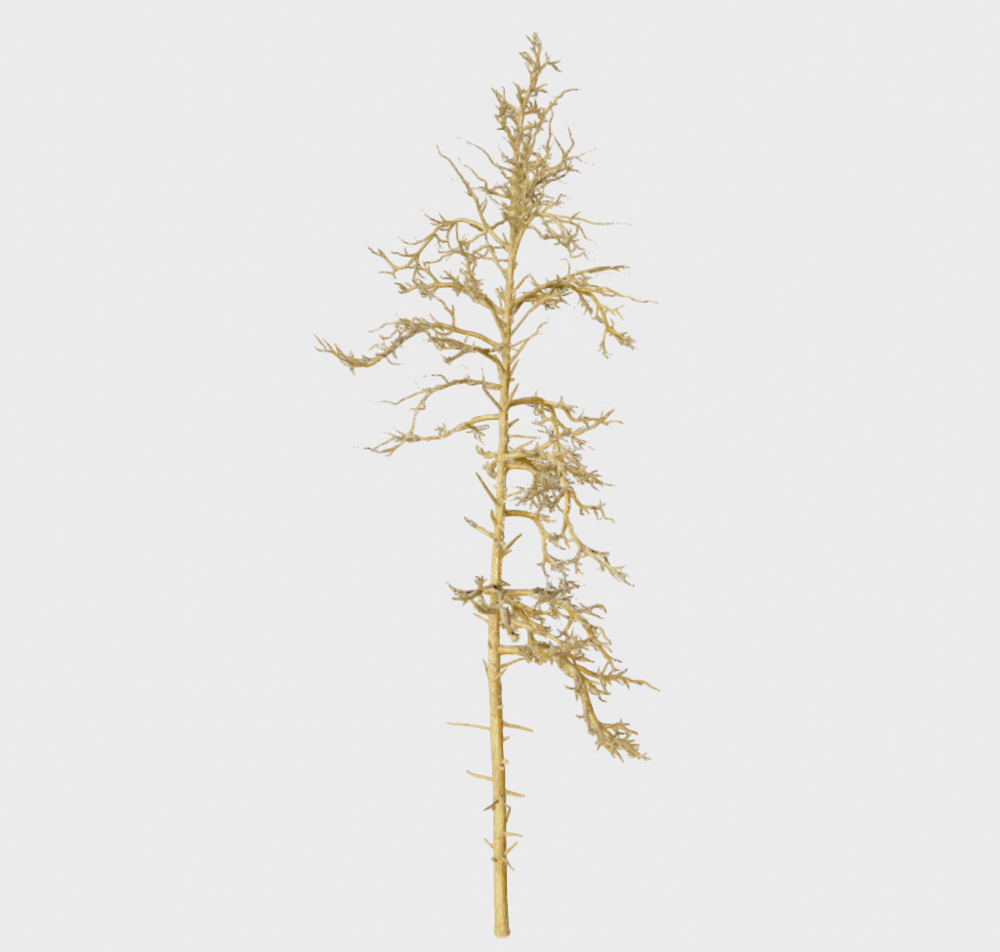
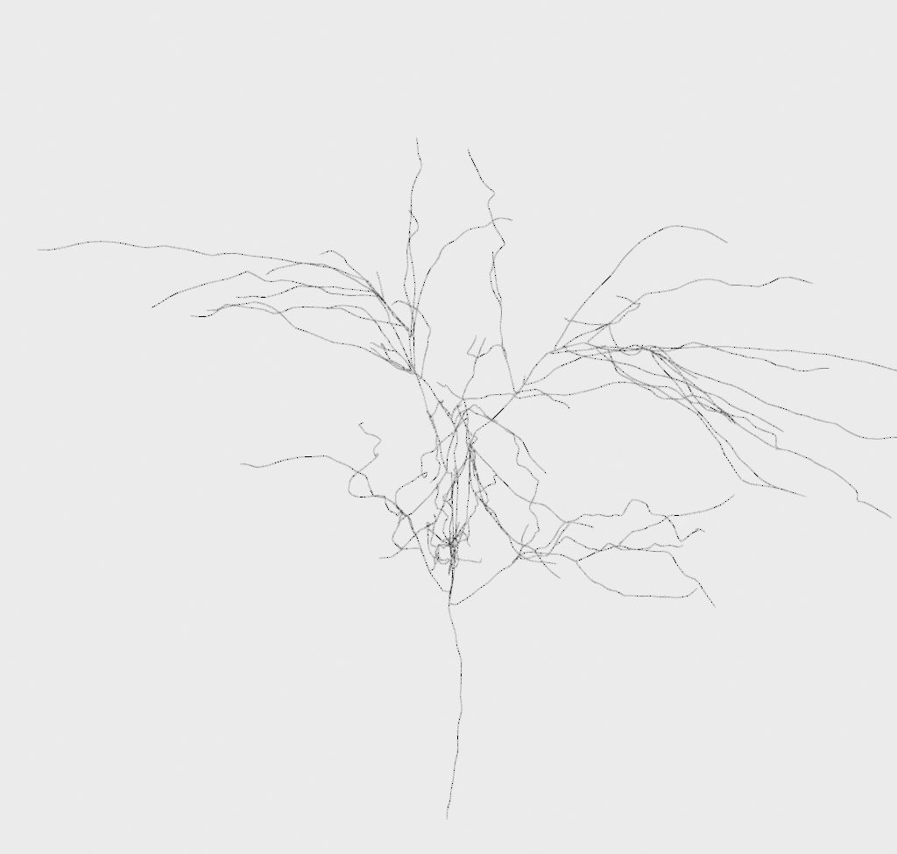
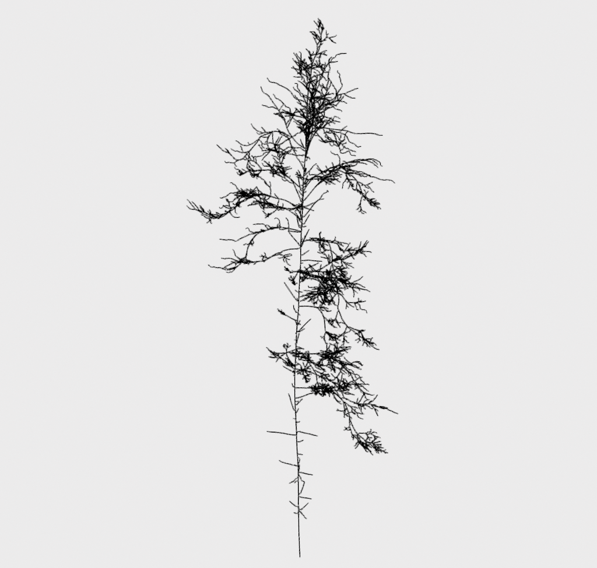

# synthetic-trees

<table>
<tr>
  <td style="text-align: center"></td>
  <td style="text-align: center"></td>
  <td style="text-align: center"></td>
</tr>
<tr>
  <td align="center">Sapling Cherry Point Cloud.</td>
  <td align="center">Apple Tree Point Cloud.</td>
  <td align="center">Pine Tree Point Cloud.</td>
</tr>
  
<tr>
<td style="text-align: center"></td>
<td style="text-align: center"></td>
<td style="text-align: center"></td>
</tr>
<tr>
  <td align="center">Sapling Cherry Ground Truth Skeleton.</td>
  <td align="center">Apple Tree Ground Truth Skeleton.</td>
  <td align="center">Pine Tree Ground Truth Skeleton.</td>
</tr>

</table>

## Description

This repository contains a library to open, visualize, process and evaluate tree point cloud skeletonization - using our dataset.
We provide a multi-species synthetic dataset with ground truth skeletons. To understand how the data was created, aswell as the evaluation metrics used - please refer to our <a href="">paper</a>:

```
@inproceedings{TODO,
    author = {TODO},
     title = {{TODO}},
 booktitle = {TODO},
     pages = {TODO},
      year = {TODO}}
```

## Installation

`pip install .`

## Usage

#### Downloading

To download the data, use the `download.py` script. This can be called
using:

```
TODO
```

Where:

- `directory` is the directory of where you want to download to.

Alternatively, the data can be downloaded from this <a href="">link</a>.

#### Visualising

To visualize the data, use the `visualize.py` script. This can be called using:

```
view-synthetic-trees -p=file_path -lw=linewidth
```

```
view-synthetic-trees -d=directory -lw=linewidth
```

Where:

- `file_path` is the path of the \*.npz file of a single tree [optional].
- `directory` is the directory of folder containing \*.npz files [optional].
- `linewidth` is the width of the skeleton lines in the visualizer [optional].

#### Evaluation

To evaluate the data from your method against the ground truth data, use the `evaluate.py`
script. This can be called using:

```
evaluate-synthetic-trees -d_gt=ground_truth_directory -d_o=output_directory, -r_o=results_save_path
```

Where:

- `ground_truth_directory` is the directory of the ground truth \*.npz files.
- `output_directory` is the directory of folder containing your skeleton outputs (in \*.ply) format.
- `results_save_path` is the the \*.csv path to save your results to.

#### Process Results

After running the evaluation, the raw results can be post-processed to provide metrics across the dataset.
This is done using the `process_results.py` script. This can be called using:

```
process-synthetic-trees-results -p=path
```

Where:

- `path` is the path of the results csv from the evaluation step.
